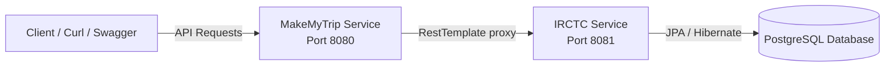

# Project Documentation: IRCTC & MakeMyTrip (MMT) Services Integration

This document describes the design, implementation, and verification of the two communicating microservices: **IRCTC Service (Provider)** and **MakeMyTrip Service (Consumer)**.

---

## 1. Architectural Overview

The project consists of two Spring Boot applications that communicate synchronously over HTTP using Spring's **RestTemplate**:



### Core Constraints & Design Patterns:
* **No Database Boundary for MMT**: MMT does not contain any database dependencies (no JPA, H2, or PostgreSQL starters in `pom.xml`), no repositories, and no local entities. It functions purely as a gateway.
* **JPA Entity Decoupling**: JPA entities are never exposed by controllers. Validation-enabled Request DTOs are accepted, and response payloads are mapped to Response DTOs.
* **Standard API Response**: All controller endpoints wrap their payloads in a standardized `ApiResponse<T>` envelope.
* **Transactional integrity**: Ticket booking and cancellation operations use transactional rollback to guarantee consistency (e.g. rolling back ticket creation if seat count updates fail).
* **Exception Propagation**: MMT intercepts HTTP error statuses (400, 404, 409) returned by IRCTC and forwards the detailed original error structure directly to the client.

---

## 2. IRCTC Service (Provider)

The IRCTC service owns the database state for users, trains, and ticket bookings. It runs on port `8081` and connects to the PostgreSQL database.

### 2.1 Database Entities & Relationship Mapping
* **[User.java](file:///c:/Users/hp/Documents/workspace-spring-tools-for-eclipse-5.1.1.RELEASE/IRCTCc/src/main/java/com/example/demo/entity/User.java)**:
  * Table: `irctc_users` (prefixed to avoid collisions with PostgreSQL reserved keywords or other tables).
  * Fields: `id` (Primary Key), `name`, `address`, `aadhar`, `email`.
  * Relationships: `@OneToMany(mappedBy = "user")` list of tickets.
* **[Train.java](file:///c:/Users/hp/Documents/workspace-spring-tools-for-eclipse-5.1.1.RELEASE/IRCTCc/src/main/java/com/example/demo/entity/Train.java)**:
  * Table: `irctc_trains`.
  * Fields: `id` (Primary Key), `trainNumber`, `trainName`, `source`, `destination`, `availableSeats`, `totalSeats`, `departureTime`, `arrivalTime`.
  * Relationships: `@OneToMany(mappedBy = "train")` list of tickets.
* **[Ticket.java](file:///c:/Users/hp/Documents/workspace-spring-tools-for-eclipse-5.1.1.RELEASE/IRCTCc/src/main/java/com/example/demo/entity/Ticket.java)**:
  * Table: `irctc_tickets`.
  * Fields: `ticketId` (Primary Key), `trainNumber`, `source`, `destination`, `seatNumber`, `status` (e.g., CONFIRMED), `bookingDate`.
  * Relationships:
    * `@ManyToOne` referencing `User` (mapped to column `user_id`).
    * `@ManyToOne` referencing `Train` (mapped to column `train_id`).
    * Both relationships are annotated with `@JsonIgnore` to prevent infinite recursion during JSON serialization.

### 2.2 Repositories
* **`IRCTCUserRepository`**: Implements query helper `boolean existsByEmail(String email)`.
* **`IRCTCTrainRepository`**: Implements `Optional<Train> findByTrainNumber(int trainNumber)` and `List<Train> findBySourceAndDestination(...)`.
* **`IRCTCTicketRepository`**: Implements `@Query` search `List<Ticket> findByUserId(int userId)` and existence validators.

### 2.3 Service Implementation (`IRCTCServiceImpl`)
Implements the core business rules:
* **Booking Tickets (`bookTicket`)**:
  * Validates if the user and train exist.
  * Checks if `availableSeats > 0`.
  * Decrements the train's available seats.
  * Creates a new ticket, assigns a seat number (`totalSeats - availableSeats`), and saves both.
  * Marked with `@Transactional` so that if saving the ticket fails, the seat deduction rolls back.
* **Cancelling Tickets (`cancelTicket`)**:
  * Finds the ticket, increments the associated train's available seats, and deletes the ticket.

### 2.4 Realistic Seed Data
The [DatabaseSeeder.java](file:///c:/Users/hp/Documents/workspace-spring-tools-for-eclipse-5.1.1.RELEASE/IRCTCc/src/main/java/com/example/demo/config/DatabaseSeeder.java) executes on startup to populate:
* **5 passengers** with mock names, addresses, and details.
* **8 realistic trains** representing major routes (e.g., Pune ↔ Mumbai, Delhi ↔ Bhopal, Delhi ↔ Mumbai) including one train with `0` seats to test seat exhaustion errors.

---

## 3. MakeMyTrip Service (Consumer)

The MMT service functions as a stateless API gateway running on port `8080`.

### 3.1 RestTemplate Configuration
Configured in [RestTemplateConfig.java](file:///c:/Users/hp/Documents/workspace-spring-tools-for-eclipse-5.1.1.RELEASE/MMT/src/main/java/com/example/demo/config/RestTemplateConfig.java) and uses property `irctc.base-url=http://localhost:8081` to dynamic-link with the provider.

### 3.2 Error Propagation (`MmtGlobalExceptionHandler`)
Intercepts:
* `HttpClientErrorException` / `HttpServerErrorException` (4xx / 5xx responses from IRCTC), parses the original JSON error body containing validation messages or custom exceptions, and forwards it directly.
* `ResourceAccessException` / `RestClientException` (e.g. if IRCTC is down) and maps it to a standard `503 Service Unavailable` status code.

---

## 4. Unified API Payloads

All responses follow this standard pattern:
```json
{
  "success": true,
  "message": "Operation description",
  "data": { ... }
}
```

### Endpoints Implemented:
* **Users CRUD**:
  * `POST   /api/v1/users` -> Create User
  * `GET    /api/v1/users/{id}` -> Read User
  * `PUT    /api/v1/users/{id}` -> Update User
  * `DELETE /api/v1/users/{id}` -> Delete User
* **Trains CRUD**:
  * `POST   /api/v1/trains` -> Add Train
  * `GET    /api/v1/trains/{trainNumber}` -> Get Train by Number
  * `GET    /api/v1/trains/search?source=X&destination=Y` -> Search Trains
  * `PUT    /api/v1/trains/{trainNumber}` -> Update Train
  * `DELETE /api/v1/trains/{trainNumber}` -> Delete Train
* **Ticket Bookings**:
  * `POST   /api/v1/tickets/book` -> Book Ticket
  * `GET    /api/v1/tickets/{id}` -> View Ticket details
  * `DELETE /api/v1/tickets/{id}` -> Cancel Ticket / Booking

*Note: MMT exposes the exact same versioned endpoints mirrored under prefix `/api/v1/mmt/...`.*

---

## 5. Verification & Testing

### 5.1 Automated Unit Tests
We implemented testing suites verifying edge-case conditions without launching a database:
* **`IRCTCServiceImplTest`**: Checks booking rules (successful booking, seat count decrement, user-not-found exceptions, train-not-found exceptions, seat exhaustion).
* **`IRCTCControllerTest` & `MmtControllerTest`**: Uses Mockito and validation constraints to check validation rule failures (like negative Aadhar, blank names, or invalid emails).
* **`MmtServiceImplTest`**: Mocks `RestTemplate` calls, query string generation, and response parsing.

Run test suites using:
```bash
# In IRCTCc project directory:
.\mvnw clean test

# In MMT project directory:
.\mvnw clean test
```

### 5.2 Manual Integration Testing via Curl
To test end-to-end integration:

1. **Start IRCTC (Provider)** on port `8081`:
   ```bash
   cd c:\Users\hp\Documents\workspace-spring-tools-for-eclipse-5.1.1.RELEASE\IRCTCc
   .\mvnw spring-boot:run
   ```

2. **Start MMT (Consumer)** on port `8080`:
   ```bash
   cd c:\Users\hp\Documents\workspace-spring-tools-for-eclipse-5.1.1.RELEASE\MMT
   .\mvnw spring-boot:run
   ```

3. **Verify via Curl commands**:
   * **Search Trains**:
     ```bash
     curl "http://localhost:8080/api/v1/mmt/trains/search?source=Pune&destination=Mumbai"
     ```
   * **Book Ticket (Success)**:
     ```bash
     curl -X POST -H "Content-Type: application/json" -d "{\"userId\": 1, \"trainNumber\": 12124}" http://localhost:8080/api/v1/mmt/tickets/book
     ```
   * **View Booked Ticket**:
     ```bash
     curl http://localhost:8080/api/v1/mmt/tickets/1
     ```
   * **Cancel Ticket**:
     ```bash
     curl -X DELETE http://localhost:8080/api/v1/mmt/tickets/1
     ```
   * **Test Seat Exhaustion Error**:
     Book on Train `12127` (seeded with 0 seats):
     ```bash
     curl -X POST -H "Content-Type: application/json" -d "{\"userId\": 1, \"trainNumber\": 12127}" http://localhost:8080/api/v1/mmt/tickets/book
     ```
   * **Test Request Validation Error**:
     Send an invalid email format:
     ```bash
     curl -X POST -H "Content-Type: application/json" -d "{\"name\": \"\", \"email\": \"invalid-email\"}" http://localhost:8080/api/v1/mmt/users
     ```
